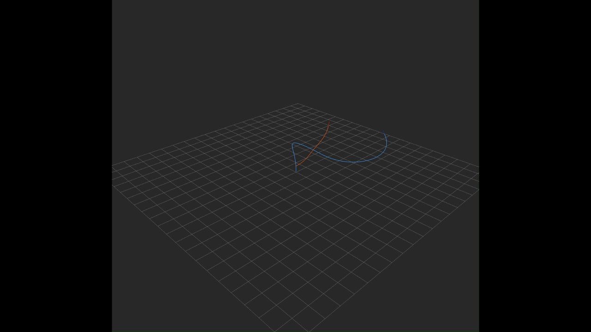

# Drone Interception Simulation

ROS 2 simulation of an interceptor drone pursuing a randomly maneuvering target drone using Proportional Navigation guidance.



## Overview

Two nodes run at 50 Hz:

- **Lead drone** — flies a randomized trajectory with smoothly varying yaw and pitch rates, starting at (10, 10, 10) m.
- **Interceptor drone** — starts at the origin, applies Proportional Navigation (PN) to close on the lead, and detonates when within 0.3 m. Falls back to pure pursuit if it overshoots.

## Requirements

- ROS 2 Humble
- `colcon`, `rviz2`, standard ROS 2 geometry/nav/visualization message packages

## Build

```bash
source /opt/ros/humble/setup.bash
colcon build
source install/setup.bash
```

## Run

```bash
./run.sh
```

Opens a tmux session with three panes: the simulation + RViz2, and topic monitors for `/lead/pose` and `/interceptor/pose`.

To run nodes individually:

```bash
ros2 run lead_drone lead_drone_node
ros2 run interceptor_drone interceptor_drone_node
```

All processes use `ROS_DOMAIN_ID=42`.

## Architecture

### Topics

| Topic | Type | Publisher |
|-------|------|-----------|
| `/lead/pose` | `geometry_msgs/PoseStamped` | lead drone |
| `/interceptor/pose` | `geometry_msgs/PoseStamped` | interceptor |
| `/interceptor/kill` | `std_msgs/Int32` | interceptor → lead (stops lead on detonation) |

### Lead drone (`lead_drone_node`)

Integrates smoothly randomized yaw/pitch rates at 50 Hz. Angular rate targets change every second and are low-pass filtered (`α = 0.02`) to produce continuous maneuvers. Pitch is clamped to ±60°. Stops its update timer when `/interceptor/kill` arrives.

### Interceptor (`interceptor_drone_node`)

On each 20 ms tick:

1. Estimates target velocity from successive poses
2. Computes LOS azimuth and elevation angles and their rates
3. Computes closing velocity along the LOS
4. **If closing** (`closing_vel > 0`): applies PN with N = 30 — `ω = N · Vc · dλ/dt`
5. **If diverging** (`closing_vel ≤ 0`): switches to pure pursuit — steers heading directly toward current LOS angles
6. Clamps angular rates to ±45°/s
7. Detonates (publishes to `/interceptor/kill`, cancels timer) when within 0.3 m

Key parameters:

| Parameter | Value |
|-----------|-------|
| Speed | 15 m/s (3× lead) |
| PN constant N | 30 |
| Detonation radius | 0.3 m |
| Max angular rate | 45°/s |

## Logging

The interceptor writes `interceptor_log.csv` to the working directory on each tick:

```
t, x, y, z, vx, vy, vz, yaw, pitch,
omega_yaw, omega_pitch,
LOS_az, LOS_el, LOS_rate_az, LOS_rate_el,
distance, closing_vel
```
